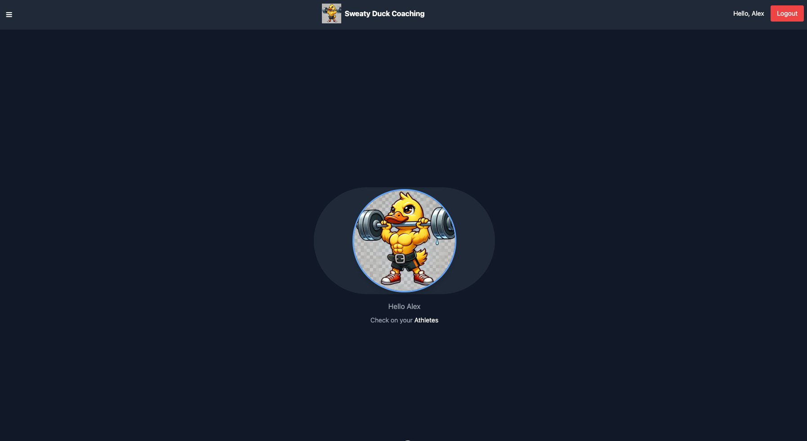
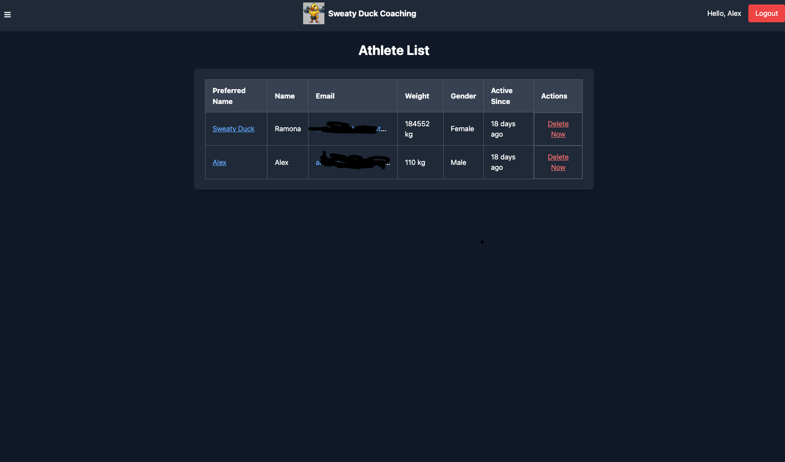
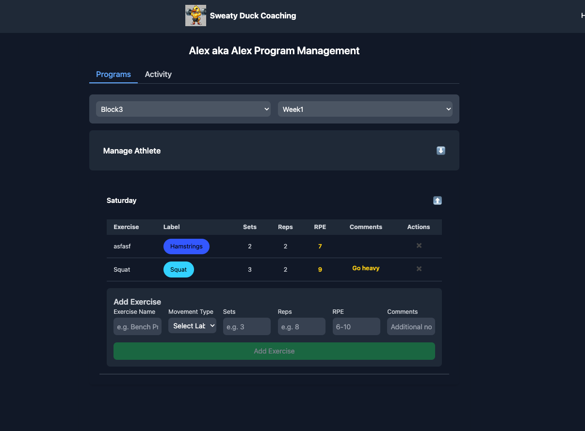
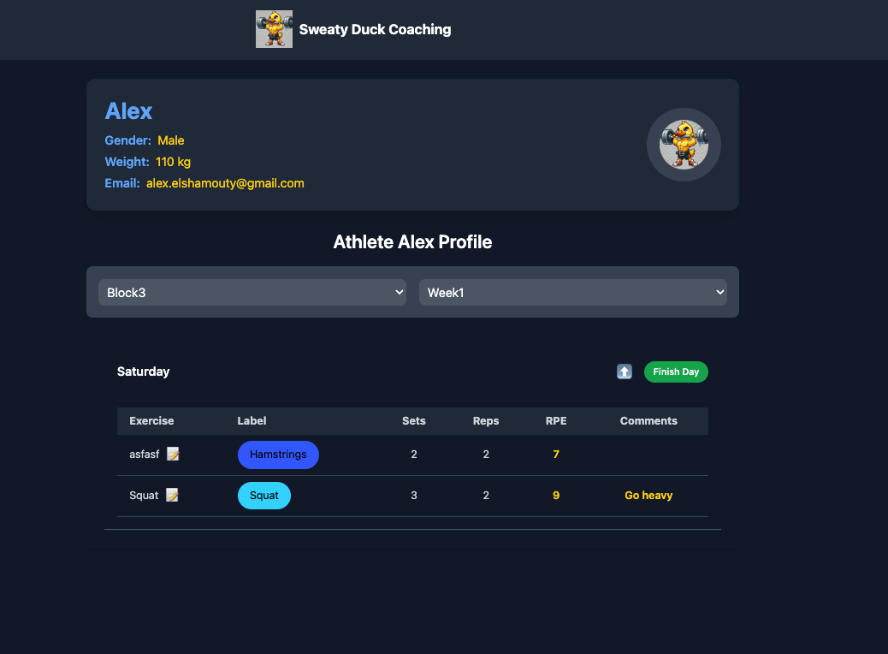
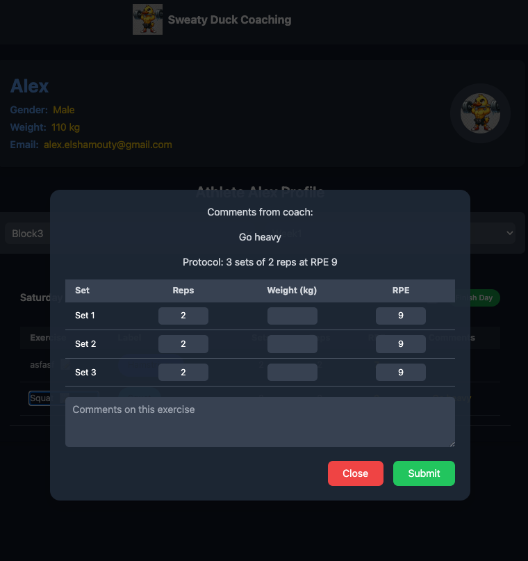
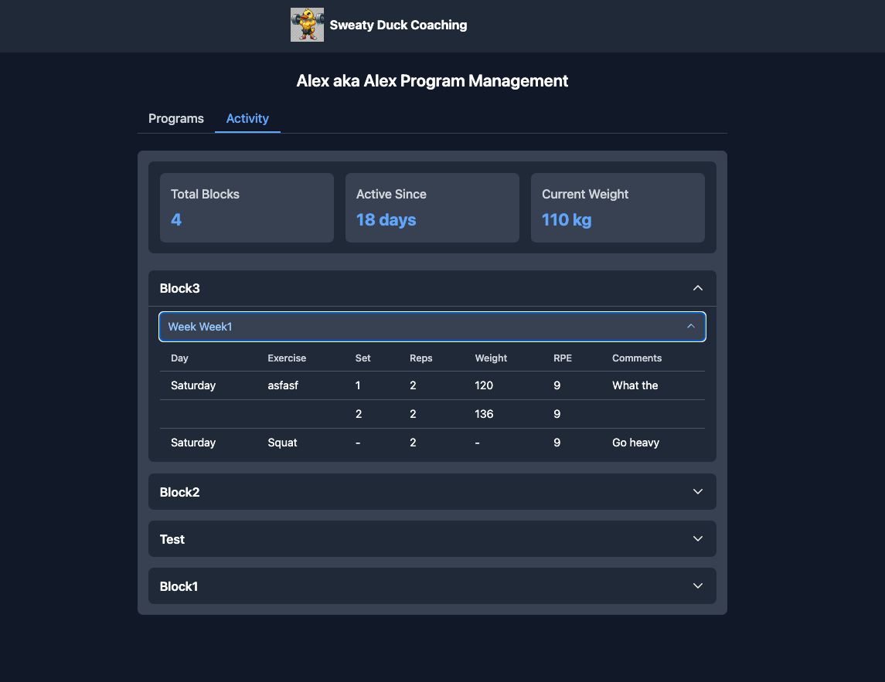

# PL Coach Application

## About PL Coach

PL Coach is a comprehensive platform designed to help powerlifting coaches and athletes manage their training programs effectively. Whether you're a coach managing multiple athletes or an individual tracking your own progress, PL Coach streamlines the process of creating, following, and analyzing training programs.

Our platform enables coaches to:
- Design personalized training programs for multiple athletes
- Track athlete progress and make real-time adjustments
- Monitor performance metrics and milestones

Athletes benefit from:
- Easy access to their training programs
- Progress tracking and performance analytics
- Direct communication with their coach
- Detailed workout history and achievements

## Screenshots

<div align="center">

### Home Page View


### Athletes Managment


### Program Managment


### User Profile &  Progress Tracking - Athlete View


### Progress Tracking - Athlete View


### Analytics Dashboard


</div>

## Features

### User Management
- Complete user registration and authentication flow
- Customizable user profiles
- Role-based access control
- Secure password management via Cognito

### Program Management
- Create and manage training programs
- Assign programs to multiple users
- Track program progress and completion
- Real-time program updates and modifications

### Multi-user Program Support
- Shared program access
- Collaborative program editing
- User-specific progress tracking
- Program version control

### User Profiles
- Detailed user information
- Progress history
- Performance metrics
- Customizable preferences

### Administrative Dashboard
- Comprehensive metrics and analytics
- User activity monitoring
- Program performance tracking
- System usage statistics
- Administrative controls for user management

## Architecture Overview

This application is built using a serverless architecture on AWS with a modern frontend framework.

### Backend Components (AWS)
- **AWS Lambda** - Serverless compute runtime
- **Amazon DynamoDB** - NoSQL database for data storage
- **Amazon Cognito** - User authentication and management
- **Amazon API Gateway** - API management and routing

### Frontend Components
- **Nuxt.js/Vue.js** - Progressive JavaScript framework
- Modular component architecture for better maintainability

## Setup Instructions

### Prerequisites
- AWS Account
- Node.js (14.x or later)
- [Serverless Framework](https://www.serverless.com/) installed globally
```bash
npm install -g serverless
```

### Backend Setup
1. Configure AWS credentials:
```bash
aws configure
```

2. Navigate to backend directory:
```bash
cd backend
```

3. Install dependencies:
```bash
npm install
```

4. Deploy the backend:
```bash
serverless deploy
```

The deployment configuration is defined in `backend/serverless-compose.yaml`.

### Frontend Setup
1. Navigate to frontend directory:
```bash
cd frontend
```

2. Install dependencies:
```bash
npm install
```

3. Run development server:
```bash
npm run dev
```

## Deployment

### Backend Deployment
The backend is deployed using Serverless Framework to AWS:

```bash
cd backend
serverless deploy
```

To deploy a specific stage:
```bash
serverless deploy --stage prod
```

### Frontend Deployment
The frontend is currently hosted on Netlify, but can be hosted on any static hosting service:

- Netlify
- Vercel
- AWS S3 + CloudFront
- GitHub Pages

To deploy to Netlify:
```bash
npm run build
netlify deploy --prod
```

## Infrastructure as Code

The backend infrastructure is defined using Serverless Framework. For more information about Serverless Framework, visit their [documentation](https://www.serverless.com/framework/docs/).

All AWS resources are automatically provisioned through the Serverless Framework configuration in `backend/serverless-compose.yaml`.

## Monitoring and Observability

The application uses [Serverless Dashboard](https://www.serverless.com/dashboard/) for development monitoring. This provides:
- Real-time function metrics
- Error tracking
- Invocation logs
- Cost analytics
- Performance insights

To access the dashboard:
```bash
# Login to serverless dashboard
serverless login

# Deploy with monitoring enabled
serverless deploy
```

View your application metrics at [dashboard.serverless.com](https://dashboard.serverless.com)

## Important Notes

- All backend services are hosted on AWS
- Frontend hosting is platform-agnostic
- Local development can be done using serverless-offline plugin
- Make sure to configure appropriate CORS settings in API Gateway
